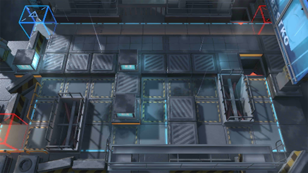

# 关卡一览————7-3

## 关卡一览

关卡编号: 7-3

关卡名称: 变节之刃

目标点生命值: 3

敌人总数: 47

理智消耗: 18

## 关卡地图

## 敌人情况

| 敌人图片 | 敌人名称 | 数量  |
|---------|-----|-----|
| ./eneIcons/eneIcons/¿ñ±©ËÞÖ÷Ê¿±ø.png| 狂暴宿主士兵  |   3  |
| ./eneIcons/eneIcons/¿ñ±©ËÞÖ÷ͶÖÀÊÖ.png| 狂暴宿主投掷手  |   6  |
| ./eneIcons/eneIcons/¿ñ±©ËÞÖ÷×鳤.png| 狂暴宿主组长  |   3  |
| ./eneIcons/eneIcons/ËÞÖ÷Ê°»ÄÕß.png| 宿主拾荒者  |   12  |
| ./eneIcons/eneIcons/ËÞÖ÷Ê¿±ø.png| 宿主士兵  |   23  |
