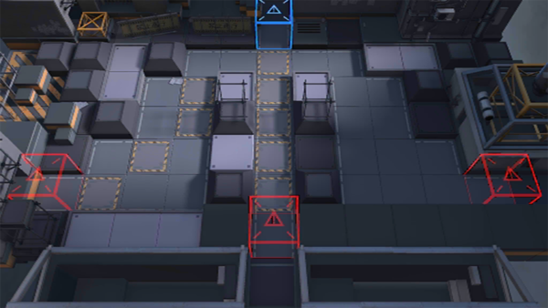

# 关卡一览————7-5

## 关卡一览

关卡编号: 7-5

关卡名称: 并肩之约-2

目标点生命值: 3

敌人总数: 70

理智消耗: 18

## 关卡地图

## 敌人情况

| 敌人图片 | 敌人名称 | 数量  |
|---------|-----|-----|
| ./eneIcons/eneIcons/Óλ÷¶Ó¾Ñ»÷ÊÖ.png| 游击队狙击手  |   2  |
| ./eneIcons/eneIcons/Óλ÷¶Ó¾Ñ»÷ÊÖ×鳤.png| 游击队狙击手组长  |   6  |
| ./eneIcons/eneIcons/Óλ÷¶ÓÁÔÈ®.png| 游击队猎犬  |   13  |
| ./eneIcons/eneIcons/Óλ÷¶ÓÁÔÈ®pro.png| 游击队猎犬pro  |   21  |
| ./eneIcons/eneIcons/Óλ÷¶Óսʿ.png| 游击队战士  |   20  |
| ./eneIcons/eneIcons/Óλ÷¶Óսʿ×鳤.png| 游击队战士组长  |   8  |
