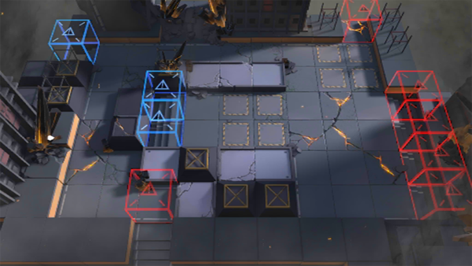

# 关卡一览————7-6

## 关卡一览

关卡编号: 7-6

关卡名称: 遗忘之地

目标点生命值: 3

敌人总数: 44

理智消耗: 18

## 关卡地图

## 敌人情况

| 敌人图片 | 敌人名称 | 数量  |
|---------|-----|-----|
| ./eneIcons/eneIcons/Óλ÷¶Ó´«Áî±ø.png| 游击队传令兵  |   4  |
| ./eneIcons/eneIcons/Óλ÷¶Ó¾Ñ»÷ÊÖ.png| 游击队狙击手  |   14  |
| ./eneIcons/eneIcons/Óλ÷¶ÓÁÔÈ®.png| 游击队猎犬  |   16  |
| ./eneIcons/eneIcons/Óλ÷¶Óսʿ.png| 游击队战士  |   10  |
