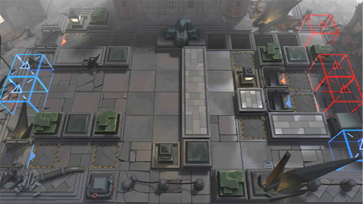

# 关卡一览————9-11

## 关卡一览

关卡编号: 9-11

关卡名称: 拉锯

目标点生命值: 3

敌人总数: 47

理智消耗: 18

## 关卡地图

## 敌人情况

| 敌人图片 | 敌人名称 | 数量  |
|---------|-----|-----|
| ./eneIcons/eneIcons/Éî³Ø°µÓ°Êõʦ.png| 深池暗影术师  |   10  |
| ./eneIcons/eneIcons/Éî³Ø·½Õóսʿ.png| 深池方阵战士  |   14  |
| ./eneIcons/eneIcons/Éî³Ø·ÉÐбø.png| 深池飞行兵  |   6  |
| ./eneIcons/eneIcons/Éî³ØÕì²ì±ø.png| 深池侦察兵  |   17  |
