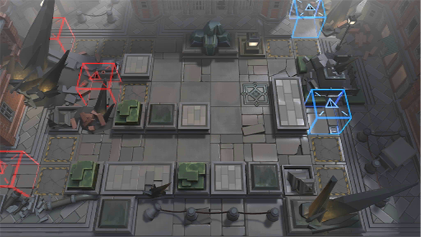

# 关卡一览————9-13

## 关卡一览

关卡编号: 9-13

关卡名称: 战地救援

目标点生命值: 3

敌人总数: 44

理智消耗: 18

## 关卡地图

## 敌人情况

| 敌人图片 | 敌人名称 | 数量  |
|---------|-----|-----|
| ./eneIcons/eneIcons/Éî³Ø·½Õóսʿ.png| 深池方阵战士  |   14  |
| ./eneIcons/eneIcons/Éî³Ø·Ù»ÙÕß.png| 深池焚毁者  |   8  |
| ./eneIcons/eneIcons/Éî³Ø¾Ñ»÷ÊÖ.png| 深池狙击手  |   10  |
| ./eneIcons/eneIcons/Éî³ØÕì²ì±ø.png| 深池侦察兵  |   12  |
