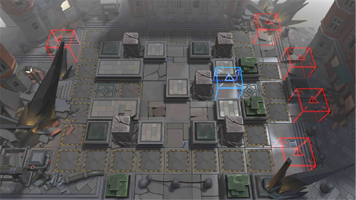

# 关卡一览————9-14

## 关卡一览

关卡编号: 9-14

关卡名称: 风中旗帜

目标点生命值: 3

敌人总数: 58

理智消耗: 21

## 关卡地图

## 敌人情况

| 敌人图片 | 敌人名称 | 数量  |
|---------|-----|-----|
| ./eneIcons/eneIcons/Éî³Ø·Ù»ÙÕß.png| 深池焚毁者  |   10  |
| ./eneIcons/eneIcons/Éî³Ø¾Ñ»÷ÊÖ.png| 深池狙击手  |   5  |
| ./eneIcons/eneIcons/Éî³ØÕì²ì±ø.png| 深池侦察兵  |   15  |
| ./eneIcons/eneIcons/Éî³ØÕì²ìÈ®.png| 深池侦察犬  |   18  |
| ./eneIcons/eneIcons/Éî³ØÖؼ×ÎÀÊ¿.png| 深池重甲卫士  |   4  |
| ./eneIcons/eneIcons/ÊØĹʯÏñ.png| 守墓石像  |   6  |
