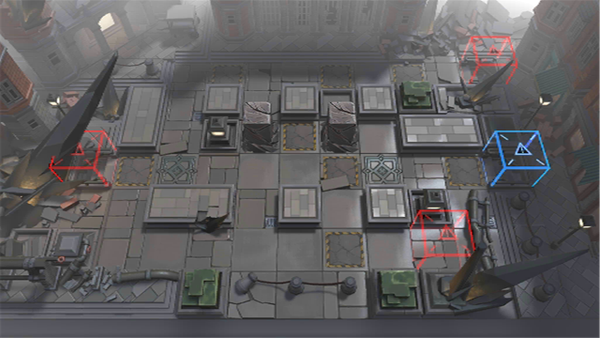

# 关卡一览————9-15

## 关卡一览

关卡编号: 9-15

关卡名称: 大地滚烫

目标点生命值: 3

敌人总数: 36

理智消耗: 18

## 关卡地图

## 敌人情况

| 敌人图片 | 敌人名称 | 数量  |
|---------|-----|-----|
| ./eneIcons/eneIcons/Éî³Ø°µÓ°Êõʦ.png| 深池暗影术师  |   5  |
| ./eneIcons/eneIcons/Éî³Ø·½Õóսʿ.png| 深池方阵战士  |   20  |
| ./eneIcons/eneIcons/Éî³ØËÜÄÜÊõʦ.png| 深池塑能术师  |   2  |
| ./eneIcons/eneIcons/Éî³ØÕì²ìÈ®.png| 深池侦察犬  |   7  |
| ./eneIcons/eneIcons/Éî³ØÖؼ×ÎÀÊ¿.png| 深池重甲卫士  |   2  |
