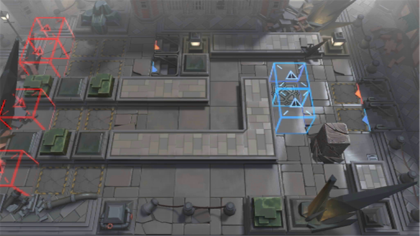

# 关卡一览————9-17

## 关卡一览

关卡编号: 9-17

关卡名称: 维多利亚士兵

目标点生命值: 3

敌人总数: 32

理智消耗: 18

## 关卡地图

## 敌人情况

| 敌人图片 | 敌人名称 | 数量  |
|---------|-----|-----|
| ./eneIcons/eneIcons/Éî³Ø·½Õóսʿ.png| 深池方阵战士  |   4  |
| ./eneIcons/eneIcons/Éî³Ø»ïÓÑÎÀ¶Ó.png| 深池伙友卫队  |   2  |
| ./eneIcons/eneIcons/Éî³Ø»ïÓÑÓ°ÈÐ.png| 深池伙友影刃  |   2  |
| ./eneIcons/eneIcons/Éî³ØËÜÄÜÊõʦ.png| 深池塑能术师  |   2  |
| ./eneIcons/eneIcons/Éî³ØÕì²ìÈ®.png| 深池侦察犬  |   22  |
