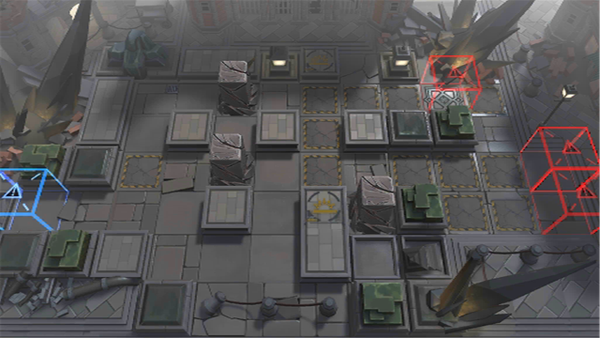

# 关卡一览————9-18

## 关卡一览

关卡编号: 9-18

关卡名称: “破晓”

目标点生命值: 3

敌人总数: 34

理智消耗: 21

## 关卡地图

## 敌人情况

| 敌人图片 | 敌人名称 | 数量  |
|---------|-----|-----|
| ./eneIcons/eneIcons/Éî³Ø°µÓ°Êõʦ.png| 深池暗影术师  |   4  |
| ./eneIcons/eneIcons/Éî³Ø·½Õóսʿ.png| 深池方阵战士  |   12  |
| ./eneIcons/eneIcons/Éî³Ø·Ù»ÙÕß.png| 深池焚毁者  |   4  |
| ./eneIcons/eneIcons/Éî³Ø»ïÓÑÎÀ¶Ó.png| 深池伙友卫队  |   4  |
| ./eneIcons/eneIcons/Éî³Ø»ïÓÑÓ°ÈÐ.png| 深池伙友影刃  |   5  |
| ./eneIcons/eneIcons/Éî³ØÕì²ìÈ®.png| 深池侦察犬  |   5  |
