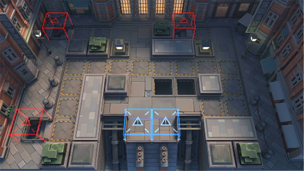

# 关卡一览————9-3

## 关卡一览

关卡编号: 9-3

关卡名称: 牌局

目标点生命值: 3

敌人总数: 45

理智消耗: 18

## 关卡地图

## 敌人情况

| 敌人图片 | 敌人名称 | 数量  |
|---------|-----|-----|
| ./eneIcons/eneIcons/Éî³Ø¾Ñ»÷ÊÖ.png| 深池狙击手  |   6  |
| ./eneIcons/eneIcons/Éî³ØÕì²ì±ø.png| 深池侦察兵  |   17  |
| ./eneIcons/eneIcons/Éî³ØÕì²ìÈ®.png| 深池侦察犬  |   20  |
| ./eneIcons/eneIcons/Éî³ØÖؼ×ÎÀÊ¿.png| 深池重甲卫士  |   2  |
