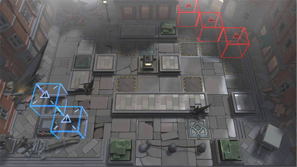

# 关卡一览————9-9

## 关卡一览

关卡编号: 9-9

关卡名称: 无辜者

目标点生命值: 3

敌人总数: 45

理智消耗: 18

## 关卡地图

## 敌人情况

| 敌人图片 | 敌人名称 | 数量  |
|---------|-----|-----|
| ./eneIcons/eneIcons/Éî³Ø·½Õóսʿ.png| 深池方阵战士  |   20  |
| ./eneIcons/eneIcons/Éî³Ø¾Ñ»÷ÊÖ.png| 深池狙击手  |   8  |
| ./eneIcons/eneIcons/Éî³ØÕì²ìÈ®.png| 深池侦察犬  |   15  |
| ./eneIcons/eneIcons/ÊØĹʯÏñ.png| 守墓石像  |   2  |
