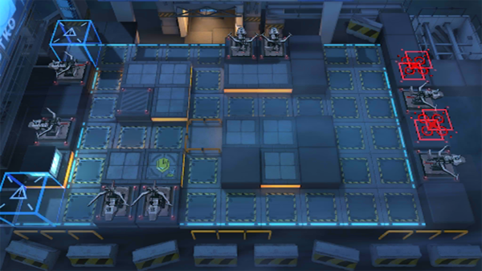

# 关卡一览————AF-5

## 关卡一览

关卡编号: AF-5

关卡名称: 润物无声

目标点生命值: 3

敌人总数: 32

理智消耗: 15

## 关卡地图

## 敌人情况

| 敌人图片 | 敌人名称 | 数量  |
|---------|-----|-----|
| ./eneIcons/eneIcons/±©û_¡¤G.png| 暴鸰·G  |   4  |
| ./eneIcons/eneIcons/·¨Êõ´óʦA1.png| 法术大师A1  |   15  |
| ./eneIcons/eneIcons/·¨Êõ´óʦA2.png| 法术大师A2  |   1  |
| ./eneIcons/eneIcons/Ñý¹Ö.png| 妖怪  |   12  |
