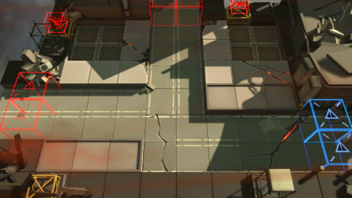

# 关卡一览————AP-1

## 关卡一览

关卡编号: AP-1

关卡名称: 源石开采保全

目标点生命值: 10

敌人总数: 24

理智消耗: 10

## 关卡地图

## 敌人情况

| 敌人图片 | 敌人名称 | 数量  |
|---------|-----|-----|
| ./eneIcons/eneIcons/ÁÔ¹·.png| 猎狗  |   3  |
| ./eneIcons/eneIcons/Ê¿±ø.png| 士兵  |   3  |
| ./eneIcons/eneIcons/Ñý¹Ö.png| 妖怪  |   2  |
| ./eneIcons/eneIcons/Դʯ³æ.png| 源石虫  |   16  |
