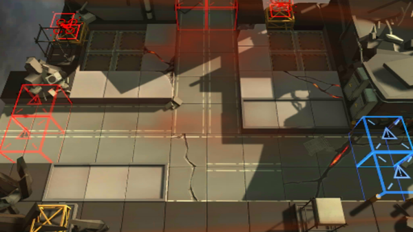

# 关卡一览————AP-2

## 关卡一览

关卡编号: AP-2

关卡名称: 源石运输保全

目标点生命值: 10

敌人总数: 44

理智消耗: 15

## 关卡地图

## 敌人情况

| 敌人图片 | 敌人名称 | 数量  |
|---------|-----|-----|
| ./eneIcons/eneIcons/ÁÔ¹·.png| 猎狗  |   9  |
| ./eneIcons/eneIcons/ÁÔ¹·pro.png| 猎狗pro  |   17  |
| ./eneIcons/eneIcons/åóÊÖ.png| 弩手  |   6  |
| ./eneIcons/eneIcons/Ê¿±ø.png| 士兵  |   6  |
| ./eneIcons/eneIcons/Ñý¹Ö.png| 妖怪  |   4  |
| ./eneIcons/eneIcons/Ñý¹ÖMKII.png| 妖怪MKII  |   2  |
