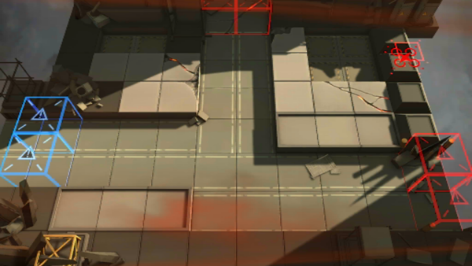

# 关卡一览————AP-3

## 关卡一览

关卡编号: AP-3

关卡名称: 精炼器材保全

目标点生命值: 3

敌人总数: 40

理智消耗: 20

## 关卡地图

## 敌人情况

| 敌人图片 | 敌人名称 | 数量  |
|---------|-----|-----|
| ./eneIcons/eneIcons/±©Í½.png| 暴徒  |   4  |
| ./eneIcons/eneIcons/·¥Ä¾»ú.png| 伐木机  |   2  |
| ./eneIcons/eneIcons/¿ñ±©µÄÁÔ¹·pro.png| 狂暴的猎狗pro  |   4  |
| ./eneIcons/eneIcons/ȼÉÕƿͶÖÀÕß.png| 燃烧瓶投掷者  |   4  |
| ./eneIcons/eneIcons/Ê°»ÄÕß.png| 拾荒者  |   2  |
| ./eneIcons/eneIcons/Êõʦ.png| 术师  |   2  |
| ./eneIcons/eneIcons/Ë«³Ö½£Ê¿.png| 双持剑士  |   4  |
| ./eneIcons/eneIcons/Ñý¹ÖMKII.png| 妖怪MKII  |   6  |
| ./eneIcons/eneIcons/Դʯ³æ¡¤¦Â.png| 源石虫·β  |   12  |
