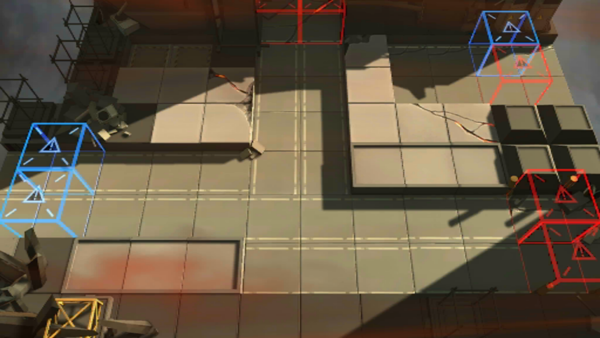

# 关卡一览————AP-4

## 关卡一览

关卡编号: AP-4

关卡名称: 矿材仓库保全

目标点生命值: 3

敌人总数: 42

理智消耗: 25

## 关卡地图

## 敌人情况

| 敌人图片 | 敌人名称 | 数量  |
|---------|-----|-----|
| ./eneIcons/eneIcons/¸ß½×Êõʦ.png| 高阶术师  |   4  |
| ./eneIcons/eneIcons/¿ñ±©µÄÁÔ¹·pro.png| 狂暴的猎狗pro  |   29  |
| ./eneIcons/eneIcons/åóÊÖ×鳤.png| 弩手组长  |   5  |
| ./eneIcons/eneIcons/ÅÚÊÖ.png| 炮手  |   1  |
| ./eneIcons/eneIcons/Ñý¹ÖMKII.png| 妖怪MKII  |   3  |
