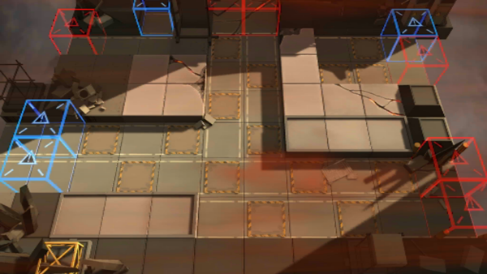

# 关卡一览————AP-5

## 关卡一览

关卡编号: AP-5

关卡名称: 精炼工厂保全

目标点生命值: 3

敌人总数: 43

理智消耗: 30

## 关卡地图

## 敌人情况

| 敌人图片 | 敌人名称 | 数量  |
|---------|-----|-----|
| ./eneIcons/eneIcons/¸ß½×Êõʦ×鳤.png| 高阶术师组长  |   1  |
| ./eneIcons/eneIcons/ÅÚ»÷×鳤.png| 炮击组长  |   4  |
| ./eneIcons/eneIcons/Èø¿¨×È´ó½£ÊÖ.png| 萨卡兹大剑手  |   7  |
| ./eneIcons/eneIcons/Èø¿¨×Ⱦѻ÷ÊÖ.png| 萨卡兹狙击手  |   6  |
| ./eneIcons/eneIcons/Ë«³Ö½£Ê¿×鳤.png| 双持剑士组长  |   25  |
