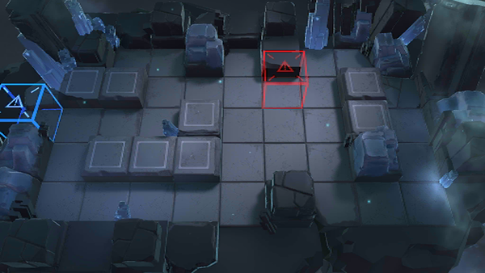

# 关卡一览————BH-1

## 关卡一览

关卡编号: BH-1

关卡名称: 异常集聚

目标点生命值: 5

敌人总数: 68

理智消耗: 6

## 关卡地图

## 敌人情况

| 敌人图片 | 敌人名称 | 数量  |
|---------|-----|-----|
| ./eneIcons/eneIcons/¸ßÄÜԴʯ³æ.png| 高能源石虫  |   7  |
| ./eneIcons/eneIcons/ËáҺԴʯ³æ.png| 酸液源石虫  |   8  |
| ./eneIcons/eneIcons/Դʯ³æ.png| 源石虫  |   12  |
| ./eneIcons/eneIcons/Դʯ³æ¡¤¦Á.png| 源石虫·α  |   32  |
| ./eneIcons/eneIcons/Դʯ³æ¡¤¦Â.png| 源石虫·β  |   9  |
