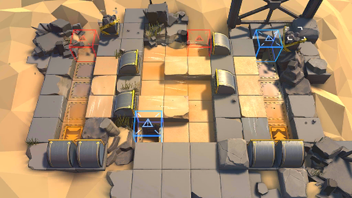

# 关卡一览————BH-2

## 关卡一览

关卡编号: BH-2

关卡名称: 强风

目标点生命值: 3

敌人总数: 35

理智消耗: 6

## 关卡地图

## 敌人情况

| 敌人图片 | 敌人名称 | 数量  |
|---------|-----|-----|
| ./eneIcons/eneIcons/ÁÔ¹·pro.png| 猎狗pro  |   10  |
| ./eneIcons/eneIcons/ÆÆÕóÕß.png| 破阵者  |   9  |
| ./eneIcons/eneIcons/ÓÄÁé.png| 幽灵  |   8  |
| ./eneIcons/eneIcons/ÓÄÁé×鳤.png| 幽灵组长  |   8  |
