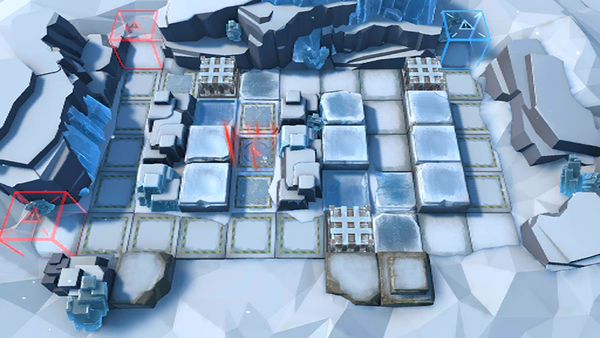

# 关卡一览————BH-3

## 关卡一览

关卡编号: BH-3

关卡名称: 致命失误

目标点生命值: 3

敌人总数: 34

理智消耗: 9

## 关卡地图

## 敌人情况

| 敌人图片 | 敌人名称 | 数量  |
|---------|-----|-----|
| ./eneIcons/eneIcons/ÎÚÈø˹ÁÑÊÞ.png| 乌萨斯裂兽  |   26  |
| ./eneIcons/eneIcons/ÎÚÈø˹ͻ»÷¶Ó¶Ó³¤.png| 乌萨斯突击队队长  |   4  |
| ./eneIcons/eneIcons/ÎÚÈø˹ͻϮåóÊÖ.png| 乌萨斯突袭弩手  |   4  |
