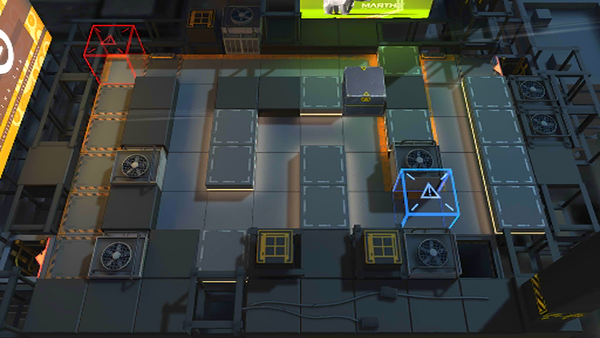

# 关卡一览————BH-4

## 关卡一览

关卡编号: BH-4

关卡名称: 战术配合

目标点生命值: 3

敌人总数: 38

理智消耗: 9

## 关卡地图

## 敌人情况

| 敌人图片 | 敌人名称 | 数量  |
|---------|-----|-----|
| ./eneIcons/eneIcons/·ÛËé¹¥¼áÊÖ.png| 粉碎攻坚手  |   1  |
| ./eneIcons/eneIcons/»¤¶Ü¸ß½×Êõʦ.png| 护盾高阶术师  |   1  |
| ./eneIcons/eneIcons/¿ñ±©µÄÁÔ¹·pro.png| 狂暴的猎狗pro  |   14  |
| ./eneIcons/eneIcons/ß±¾ýÕß.png| 弑君者  |   1  |
| ./eneIcons/eneIcons/Ë«³Ö½£Ê¿×鳤.png| 双持剑士组长  |   12  |
| ./eneIcons/eneIcons/Ëé¹Ç.png| 碎骨  |   1  |
| ./eneIcons/eneIcons/ÓÄÁé.png| 幽灵  |   5  |
| ./eneIcons/eneIcons/ÖØ×°·ÀÓù×鳤.png| 重装防御组长  |   3  |
