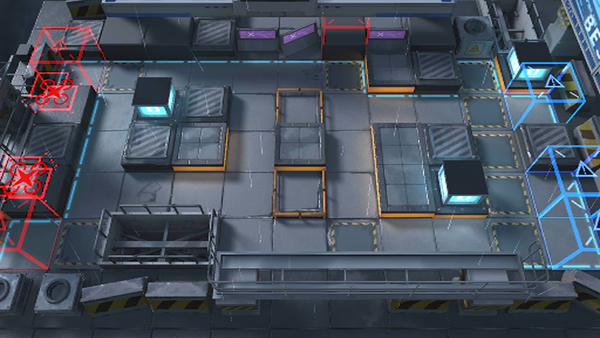

# 关卡一览————BH-5

## 关卡一览

关卡编号: BH-5

关卡名称: 齐唱

目标点生命值: 3

敌人总数: 43

理智消耗: 12

## 关卡地图

## 敌人情况

| 敌人图片 | 敌人名称 | 数量  |
|---------|-----|-----|
| ./eneIcons/eneIcons/·¨Êõ´óʦA1.png| 法术大师A1  |   14  |
| ./eneIcons/eneIcons/·¨Êõ½üÎÀ.png| 法术近卫  |   16  |
| ./eneIcons/eneIcons/ÌØÕ½Êõʦ.png| 特战术师  |   8  |
| ./eneIcons/eneIcons/ÌØÕ½Êõʦ×鳤.png| 特战术师组长  |   5  |
