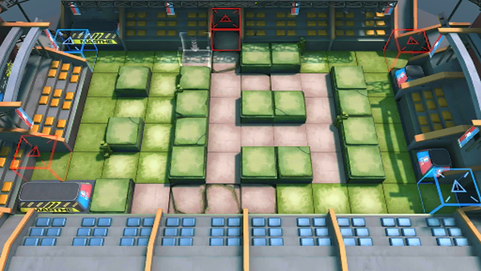

# 关卡一览————BH-6

## 关卡一览

关卡编号: BH-6

关卡名称: 光荣援助

目标点生命值: 3

敌人总数: 72

理智消耗: 12

## 关卡地图

## 敌人情况

| 敌人图片 | 敌人名称 | 数量  |
|---------|-----|-----|
| ./eneIcons/eneIcons/¡°ËÜÁÏ¡±ÉªÆæÑÇ¿Ë.png| “塑料”瑟奇亚克  |   1  |
| ./eneIcons/eneIcons/¡°ÐâÍ­¡±°Â¶ûĬ¡¤Ó¢¸ñÀ­.png| “锈铜”奥尔默·英格拉  |   1  |
| ./eneIcons/eneIcons/³Ö¶Ü¾«ÈñÆïÊ¿.png| 持盾精锐骑士  |   7  |
| ./eneIcons/eneIcons/·ÐѪÆïÊ¿Íž«Èñ.png| 沸血骑士团精锐  |   5  |
| ./eneIcons/eneIcons/ºÀ»ªÔÞÖúÎÞÈË»ú.png| 豪华赞助无人机  |   2  |
| ./eneIcons/eneIcons/ºôÐ¥ÆïÊ¿Íž«Èñ.png| 呼啸骑士团精锐  |   2  |
| ./eneIcons/eneIcons/ÎÞÃû¾«ÈñÆïÊ¿.png| 无名精锐骑士  |   25  |
| ./eneIcons/eneIcons/ѵÁ·Óòб©Ç¯ÊÞ.png| 训练用残暴钳兽  |   19  |
| ./eneIcons/eneIcons/ѵÁ·ÓÃǯÊÞ.png| 训练用钳兽  |   6  |
| ./eneIcons/eneIcons/ÔÞÖúÎÞÈË»ú.png| 赞助无人机  |   4  |
