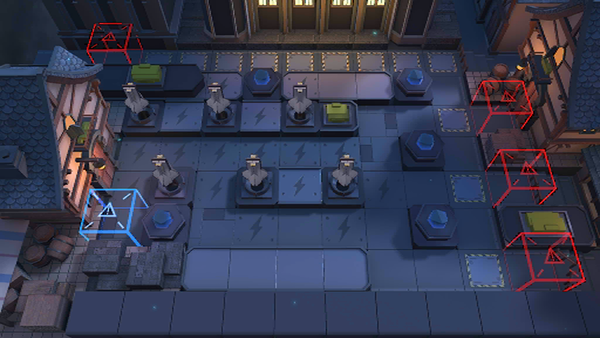

# 关卡一览————BH-7

## 关卡一览

关卡编号: BH-7

关卡名称: 坚守阵地

目标点生命值: 3

敌人总数: 35

理智消耗: 15

## 关卡地图

## 敌人情况

| 敌人图片 | 敌人名称 | 数量  |
|---------|-----|-----|
| ./eneIcons/eneIcons/¶¬ÁéÁÔÈ®pro.png| 冬灵猎犬pro  |   11  |
| ./eneIcons/eneIcons/¶¬ÁéѪÎ×.png| 冬灵血巫  |   2  |
| ./eneIcons/eneIcons/¶¬ÁéѪÎ×´óʦ.png| 冬灵血巫大师  |   7  |
| ./eneIcons/eneIcons/À³ËþÄáÑÇÅѱø×鳤.png| 莱塔尼亚叛兵组长  |   4  |
| ./eneIcons/eneIcons/À³ËþÄáÑÇÇáÓïÕß.png| 莱塔尼亚轻语者  |   4  |
| ./eneIcons/eneIcons/ÄàÑÒС¶Ó¼ùÐÐÕß×鳤.png| 泥岩小队践行者组长  |   3  |
| ./eneIcons/eneIcons/Î×Êõ¾ÞÏñ.png| 巫术巨像  |   4  |
