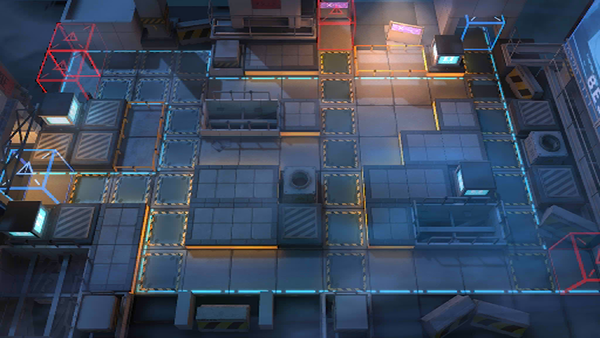

# 关卡一览————BH-8

## 关卡一览

关卡编号: BH-8

关卡名称: 堵不如疏

目标点生命值: 3

敌人总数: 51

理智消耗: 18

## 关卡地图

## 敌人情况

| 敌人图片 | 敌人名称 | 数量  |
|---------|-----|-----|
| ./eneIcons/eneIcons/¡°ÊóÍõ¡±.png| “鼠王”  |   1  |
| ./eneIcons/eneIcons/²½±ø×鳤.png| 步兵组长  |   30  |
| ./eneIcons/eneIcons/»ÒβÏãÖ÷.png| 灰尾香主  |   4  |
| ./eneIcons/eneIcons/¾Ñ»÷²½±ø×鳤.png| 狙击步兵组长  |   5  |
| ./eneIcons/eneIcons/ÇãÔþÕß.png| 倾轧者  |   2  |
| ./eneIcons/eneIcons/Ìع¤×鳤.png| 特工组长  |   9  |
