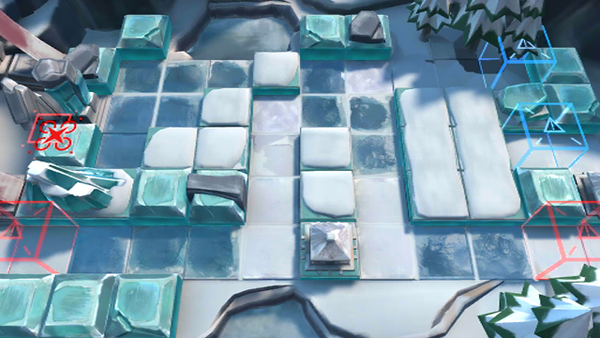

# 关卡一览————BI-1

## 关卡一览

关卡编号: BI-1

关卡名称: 不欢而聚

目标点生命值: 3

敌人总数: 17

理智消耗: 9

## 关卡地图

## 敌人情况

| 敌人图片 | 敌人名称 | 数量  |
|---------|-----|-----|
| ./eneIcons/eneIcons/±ùԭսʿ.png| 冰原战士  |   4  |
| ./eneIcons/eneIcons/¼á±ù.png| 坚冰  |   1  |
| ./eneIcons/eneIcons/צÊÞ.png| 爪兽  |   12  |
