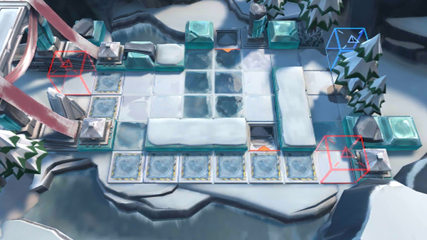

# 关卡一览————BI-3

## 关卡一览

关卡编号: BI-3

关卡名称: 人心难测

目标点生命值: 3

敌人总数: 27

理智消耗: 9

## 关卡地图

## 敌人情况

| 敌人图片 | 敌人名称 | 数量  |
|---------|-----|-----|
| ./eneIcons/eneIcons/±ùÔ­Êõʦ.png| 冰原术师  |   3  |
| ./eneIcons/eneIcons/±ùԭսʿ.png| 冰原战士  |   13  |
| ./eneIcons/eneIcons/צÊÞ.png| 爪兽  |   11  |
