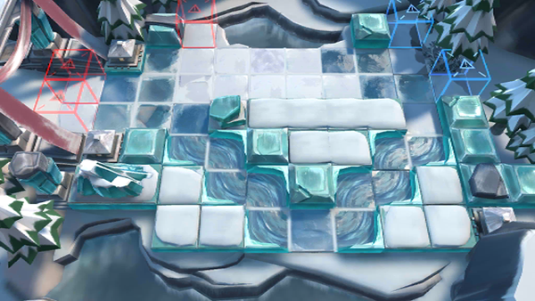

# 关卡一览————BI-6

## 关卡一览

关卡编号: BI-6

关卡名称: 歧路

目标点生命值: 3

敌人总数: 42

理智消耗: 15

## 关卡地图

## 敌人情况

| 敌人图片 | 敌人名称 | 数量  |
|---------|-----|-----|
| ./eneIcons/eneIcons/±ùÔ­¿ñսʿ.png| 冰原狂战士  |   5  |
| ./eneIcons/eneIcons/±ùÔ­ÁÔÈË.png| 冰原猎人  |   2  |
| ./eneIcons/eneIcons/±ùÔ­ÎÀ·¨Õß.png| 冰原卫法者  |   6  |
| ./eneIcons/eneIcons/±ùԭսʿ.png| 冰原战士  |   11  |
| ./eneIcons/eneIcons/צÊÞ.png| 爪兽  |   18  |
