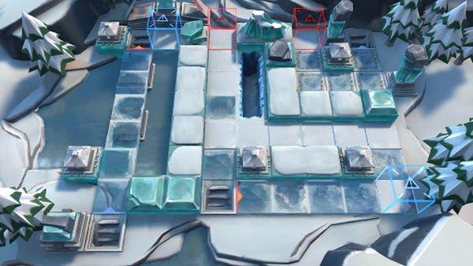

# 关卡一览————BI-8

## 关卡一览

关卡编号: BI-8

关卡名称: 将军

目标点生命值: 3

敌人总数: 25

理智消耗: 18

## 关卡地图

## 敌人情况

| 敌人图片 | 敌人名称 | 数量  |
|---------|-----|-----|
| ./eneIcons/eneIcons/±ùÔ­Êõʦ.png| 冰原术师  |   2  |
| ./eneIcons/eneIcons/±ùԭսʿ.png| 冰原战士  |   13  |
| ./eneIcons/eneIcons/¼á±ù.png| 坚冰  |   9  |
| ./eneIcons/eneIcons/ïµ.png| 锏  |   1  |
