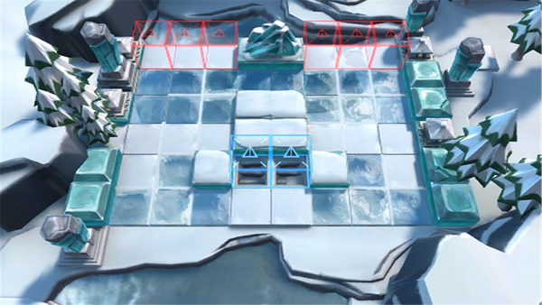

# 关卡一览————BI-EX-1

## 关卡一览

关卡编号: BI-EX-1

关卡名称: 孤兵

目标点生命值: 3

敌人总数: 51

理智消耗: 10

## 关卡地图

## 敌人情况

| 敌人图片 | 敌人名称 | 数量  |
|---------|-----|-----|
| ./eneIcons/eneIcons/±ùÔ­ÁÔÈ˶ӳ¤.png| 冰原猎人队长  |   3  |
| ./eneIcons/eneIcons/±ùԭսʿ¶Ó³¤.png| 冰原战士队长  |   20  |
| ./eneIcons/eneIcons/Ð×צÊÞ.png| 凶爪兽  |   28  |
