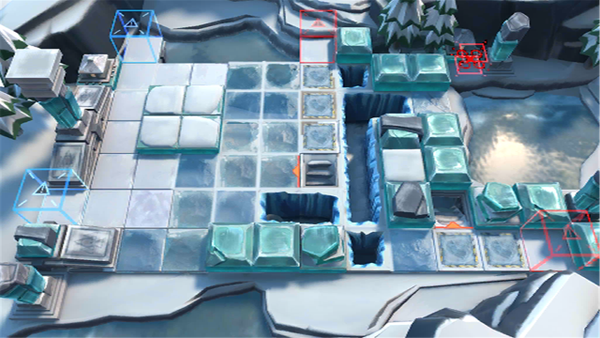

# 关卡一览————BI-EX-2

## 关卡一览

关卡编号: BI-EX-2

关卡名称: 过度扩张

目标点生命值: 3

敌人总数: 37

理智消耗: 10

## 关卡地图

## 敌人情况

| 敌人图片 | 敌人名称 | 数量  |
|---------|-----|-----|
| ./eneIcons/eneIcons/±ùÔ­Óù·¨Õß.png| 冰原御法者  |   14  |
| ./eneIcons/eneIcons/±ùԭսʿ¶Ó³¤.png| 冰原战士队长  |   19  |
| ./eneIcons/eneIcons/¼á±ùAS.T.png| 坚冰AS.T  |   4  |
