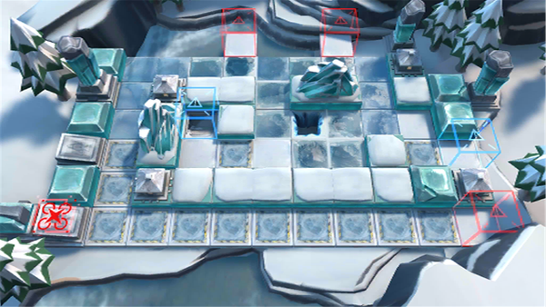

# 关卡一览————BI-EX-3

## 关卡一览

关卡编号: BI-EX-3

关卡名称: 吃过路兵

目标点生命值: 3

敌人总数: 44

理智消耗: 15

## 关卡地图

## 敌人情况

| 敌人图片 | 敌人名称 | 数量  |
|---------|-----|-----|
| ./eneIcons/eneIcons/±ùÔ­Êõʦ¶Ó³¤.png| 冰原术师队长  |   3  |
| ./eneIcons/eneIcons/±ùÔ­Óù·¨Õß.png| 冰原御法者  |   6  |
| ./eneIcons/eneIcons/±ùԭսʿ¶Ó³¤.png| 冰原战士队长  |   32  |
| ./eneIcons/eneIcons/¼á±ùAS.T.png| 坚冰AS.T  |   3  |
