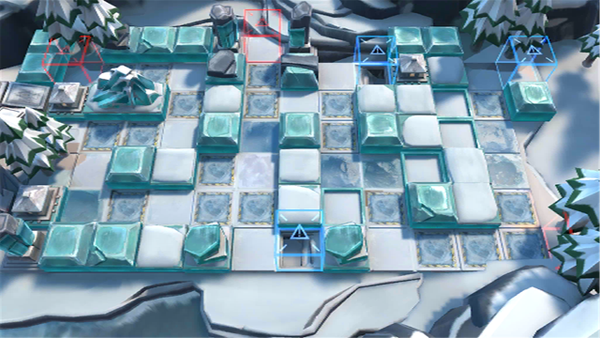

# 关卡一览————BI-EX-8

## 关卡一览

关卡编号: BI-EX-8

关卡名称: 后翼弃兵

目标点生命值: 3

敌人总数: 23

理智消耗: 20

## 关卡地图

## 敌人情况

| 敌人图片 | 敌人名称 | 数量  |
|---------|-----|-----|
| ./eneIcons/eneIcons/±ùÔ­¿ñսʿ¶Ó³¤.png| 冰原狂战士队长  |   6  |
| ./eneIcons/eneIcons/±ùԭսʿ¶Ó³¤.png| 冰原战士队长  |   6  |
| ./eneIcons/eneIcons/ïµ.png| 锏  |   1  |
| ./eneIcons/eneIcons/ɽѩ¹í¶Ó³¤.png| 山雪鬼队长  |   2  |
| ./eneIcons/eneIcons/Ð×צÊÞ.png| 凶爪兽  |   8  |
