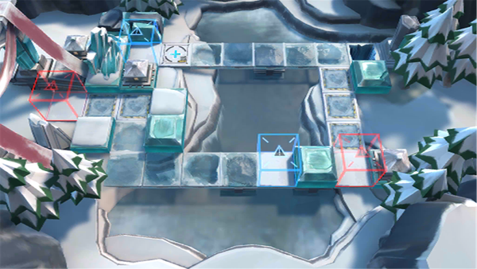

# 关卡一览————BI-TR-1

## 关卡一览

关卡编号: BI-TR-1

关卡名称: 小心地滑

目标点生命值: 5

敌人总数: 8

理智消耗: 0

## 关卡地图

## 敌人情况

| 敌人图片 | 敌人名称 | 数量  |
|---------|-----|-----|
| ./eneIcons/eneIcons/±ùԭսʿ.png| 冰原战士  |   7  |
| ./eneIcons/eneIcons/ÅÍз.png| 磐蟹  |   1  |
