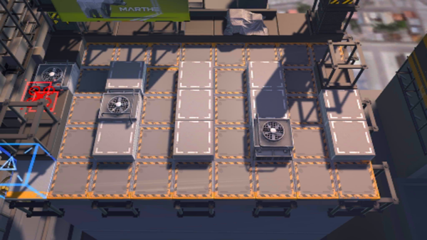

# 关卡一览————CA-2

## 关卡一览

关卡编号: CA-2

关卡名称: 勘探基点净空

目标点生命值: 8

敌人总数: 30

理智消耗: 15

## 关卡地图

## 敌人情况

| 敌人图片 | 敌人名称 | 数量  |
|---------|-----|-----|
| ./eneIcons/eneIcons/Ñý¹Ö.png| 妖怪  |   27  |
| ./eneIcons/eneIcons/Ñý¹ÖMKII.png| 妖怪MKII  |   3  |
