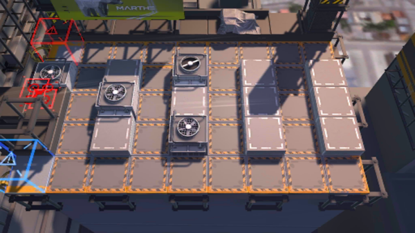

# 关卡一览————CA-3

## 关卡一览

关卡编号: CA-3

关卡名称: 巡逻路线净空

目标点生命值: 3

敌人总数: 39

理智消耗: 20

## 关卡地图

## 敌人情况

| 敌人图片 | 敌人名称 | 数量  |
|---------|-----|-----|
| ./eneIcons/eneIcons/±©Í½.png| 暴徒  |   3  |
| ./eneIcons/eneIcons/Ñý¹Ö.png| 妖怪  |   25  |
| ./eneIcons/eneIcons/Ñý¹ÖMKII.png| 妖怪MKII  |   9  |
| ./eneIcons/eneIcons/Óù4.png| 御4  |   2  |
