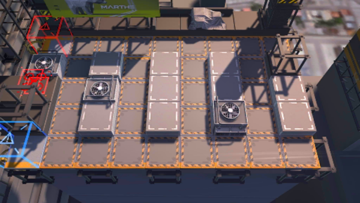

# 关卡一览————CA-4

## 关卡一览

关卡编号: CA-4

关卡名称: 任务区域净空

目标点生命值: 3

敌人总数: 39

理智消耗: 25

## 关卡地图

## 敌人情况

| 敌人图片 | 敌人名称 | 数量  |
|---------|-----|-----|
| ./eneIcons/eneIcons/¸ß½×Êõʦ.png| 高阶术师  |   2  |
| ./eneIcons/eneIcons/¿Õ½µ×鳤.png| 空降组长  |   8  |
| ./eneIcons/eneIcons/ÍþÁú.png| 威龙  |   1  |
| ./eneIcons/eneIcons/Ñý¹Ö.png| 妖怪  |   15  |
| ./eneIcons/eneIcons/Ñý¹ÖMKII.png| 妖怪MKII  |   13  |
