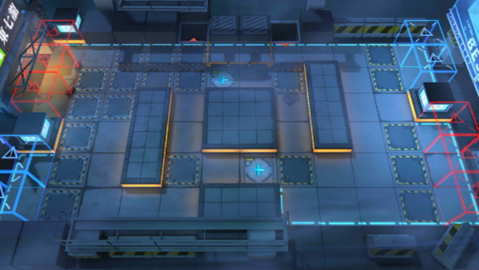

# 关卡一览————CB-10

## 关卡一览

关卡编号: CB-10

关卡名称: 1:11A.M.

目标点生命值: 3

敌人总数: 39

理智消耗: 20

## 关卡地图

## 敌人情况

| 敌人图片 | 敌人名称 | 数量  |
|---------|-----|-----|
| ./eneIcons/eneIcons/¡°ÊóÍõ¡±.png| “鼠王”  |   1  |
| ./eneIcons/eneIcons/´òÊÖ.png| 打手  |   2  |
| ./eneIcons/eneIcons/»Òβ.png| 灰尾  |   6  |
| ./eneIcons/eneIcons/ÉäÊÖ.png| 射手  |   8  |
| ./eneIcons/eneIcons/Î÷Î÷ÀïÈË.png| 西西里人  |   22  |
