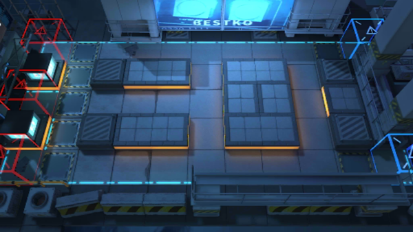

# 关卡一览————CB-1

## 关卡一览

关卡编号: CB-1

关卡名称: 6:44P.M.

目标点生命值: 10

敌人总数: 23

理智消耗: 10

## 关卡地图

## 敌人情况

| 敌人图片 | 敌人名称 | 数量  |
|---------|-----|-----|
| ./eneIcons/eneIcons/±àÖÆÊõʦ.png| 编制术师  |   2  |
| ./eneIcons/eneIcons/»ú¶¯ÎÀ±ø.png| 机动卫兵  |   8  |
| ./eneIcons/eneIcons/Î÷Î÷ÀïÈË.png| 西西里人  |   13  |
