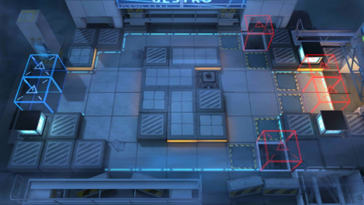

# 关卡一览————CB-2

## 关卡一览

关卡编号: CB-2

关卡名称: 7:15P.M.

目标点生命值: 10

敌人总数: 26

理智消耗: 10

## 关卡地图

## 敌人情况

| 敌人图片 | 敌人名称 | 数量  |
|---------|-----|-----|
| ./eneIcons/eneIcons/ÁÔ¹·.png| 猎狗  |   5  |
| ./eneIcons/eneIcons/ÉäÊÖ.png| 射手  |   9  |
| ./eneIcons/eneIcons/Î÷Î÷ÀïÈË.png| 西西里人  |   12  |
