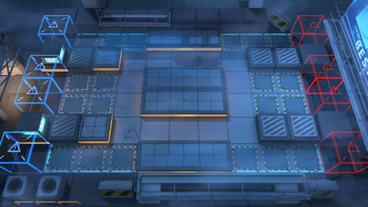

# 关卡一览————CB-5

## 关卡一览

关卡编号: CB-5

关卡名称: 8:31P.M.

目标点生命值: 3

敌人总数: 32

理智消耗: 15

## 关卡地图

## 敌人情况

| 敌人图片 | 敌人名称 | 数量  |
|---------|-----|-----|
| ./eneIcons/eneIcons/´òÊÖ.png| 打手  |   12  |
| ./eneIcons/eneIcons/ÆÛÁèÕß.png| 欺凌者  |   2  |
| ./eneIcons/eneIcons/Î÷Î÷ÀïÈË.png| 西西里人  |   18  |
