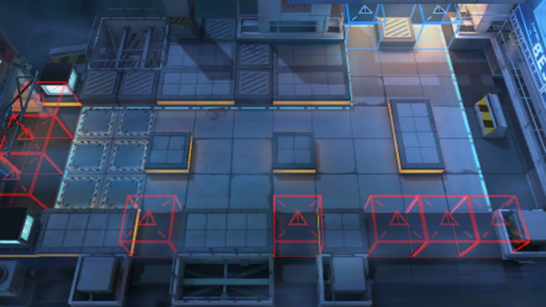

# 关卡一览————CB-6

## 关卡一览

关卡编号: CB-6

关卡名称: 10:26P.M.

目标点生命值: 3

敌人总数: 45

理智消耗: 15

## 关卡地图

## 敌人情况

| 敌人图片 | 敌人名称 | 数量  |
|---------|-----|-----|
| ./eneIcons/eneIcons/±àÖÆÊõʦ.png| 编制术师  |   8  |
| ./eneIcons/eneIcons/´òÊÖ.png| 打手  |   8  |
| ./eneIcons/eneIcons/ÆÛÁèÕß.png| 欺凌者  |   2  |
| ./eneIcons/eneIcons/Î÷Î÷ÀïÈË.png| 西西里人  |   27  |
