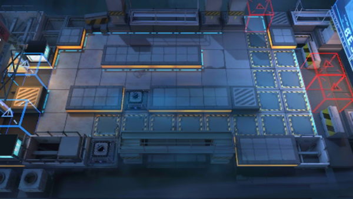

# 关卡一览————CB-7

## 关卡一览

关卡编号: CB-7

关卡名称: 11:08P.M.

目标点生命值: 3

敌人总数: 36

理智消耗: 15

## 关卡地图

## 敌人情况

| 敌人图片 | 敌人名称 | 数量  |
|---------|-----|-----|
| ./eneIcons/eneIcons/´òÊÖ.png| 打手  |   4  |
| ./eneIcons/eneIcons/»ú¶¯ÎÀ±ø.png| 机动卫兵  |   7  |
| ./eneIcons/eneIcons/¿ñͽ.png| 狂徒  |   7  |
| ./eneIcons/eneIcons/ÉäÊÖ.png| 射手  |   13  |
| ./eneIcons/eneIcons/Î÷Î÷ÀïÈË.png| 西西里人  |   5  |
