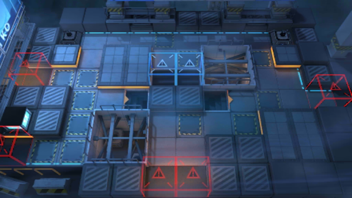

# 关卡一览————CB-9

## 关卡一览

关卡编号: CB-9

关卡名称: 0:01A.M.

目标点生命值: 3

敌人总数: 33

理智消耗: 20

## 关卡地图

## 敌人情况

| 敌人图片 | 敌人名称 | 数量  |
|---------|-----|-----|
| ./eneIcons/eneIcons/±àÖÆÊõʦ.png| 编制术师  |   3  |
| ./eneIcons/eneIcons/»Òβ.png| 灰尾  |   3  |
| ./eneIcons/eneIcons/¾«¸É´òÊÖ.png| 精干打手  |   4  |
| ./eneIcons/eneIcons/¿ñͽ.png| 狂徒  |   2  |
| ./eneIcons/eneIcons/ÆÛÁèÕß.png| 欺凌者  |   3  |
| ./eneIcons/eneIcons/ÉñÉäÊÖ.png| 神射手  |   4  |
| ./eneIcons/eneIcons/Î÷Î÷ÀïÈË.png| 西西里人  |   14  |
