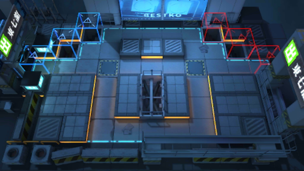

# 关卡一览————CB-EX3

## 关卡一览

关卡编号: CB-EX3

关卡名称: 林中小屋

目标点生命值: 3

敌人总数: 37

理智消耗: 15

## 关卡地图

## 敌人情况

| 敌人图片 | 敌人名称 | 数量  |
|---------|-----|-----|
| ./eneIcons/eneIcons/±àÖÆÊõʦ.png| 编制术师  |   10  |
| ./eneIcons/eneIcons/±àÖÆÊõʦ×鳤.png| 编制术师组长  |   2  |
| ./eneIcons/eneIcons/¾«¸É´òÊÖ.png| 精干打手  |   5  |
| ./eneIcons/eneIcons/¾«ÈñÎ÷Î÷ÀïÈË.png| 精锐西西里人  |   10  |
| ./eneIcons/eneIcons/¿ñͽ.png| 狂徒  |   1  |
| ./eneIcons/eneIcons/ÁÔ¹·pro.png| 猎狗pro  |   6  |
| ./eneIcons/eneIcons/ĩ·¿ñͽ.png| 末路狂徒  |   3  |
