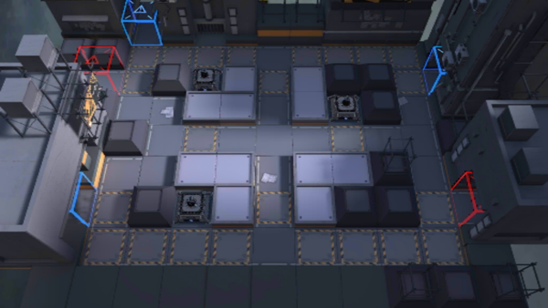

# 关卡一览————CB-EX5

## 关卡一览

关卡编号: CB-EX5

关卡名称: 十字路口

目标点生命值: 3

敌人总数: 37

理智消耗: 20

## 关卡地图

## 敌人情况

| 敌人图片 | 敌人名称 | 数量  |
|---------|-----|-----|
| ./eneIcons/eneIcons/±àÖÆÊõʦ×鳤.png| 编制术师组长  |   4  |
| ./eneIcons/eneIcons/¾«¸É´òÊÖ.png| 精干打手  |   12  |
| ./eneIcons/eneIcons/¾«ÈñÎ÷Î÷ÀïÈË.png| 精锐西西里人  |   10  |
| ./eneIcons/eneIcons/ĩ·¿ñͽ.png| 末路狂徒  |   10  |
| ./eneIcons/eneIcons/ÇãÔþÕß.png| 倾轧者  |   1  |
