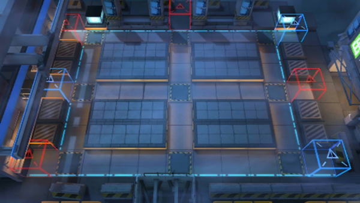

# 关卡一览————CB-EX7

## 关卡一览

关卡编号: CB-EX7

关卡名称: 晨练时间

目标点生命值: 3

敌人总数: 35

理智消耗: 20

## 关卡地图

## 敌人情况

| 敌人图片 | 敌人名称 | 数量  |
|---------|-----|-----|
| ./eneIcons/eneIcons/¡°ÊóÍõ¡±.png| “鼠王”  |   1  |
| ./eneIcons/eneIcons/±àÖÆÊõʦ×鳤.png| 编制术师组长  |   6  |
| ./eneIcons/eneIcons/»ÒβÏãÖ÷.png| 灰尾香主  |   4  |
| ./eneIcons/eneIcons/¾«¸É´òÊÖ.png| 精干打手  |   8  |
| ./eneIcons/eneIcons/ÇãÔþÕß.png| 倾轧者  |   1  |
| ./eneIcons/eneIcons/Դʯ³æ¡¤¦Â.png| 源石虫·β  |   15  |
