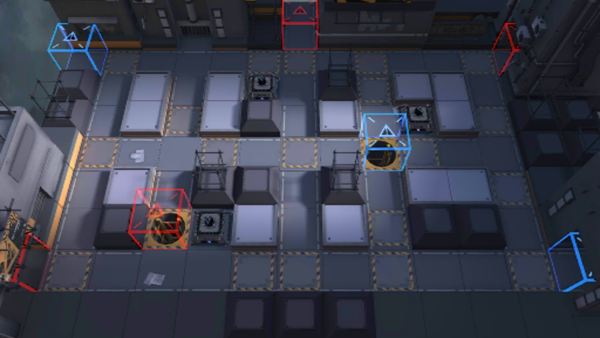

# 关卡一览————CB-EX8

## 关卡一览

关卡编号: CB-EX8

关卡名称: 日常

目标点生命值: 3

敌人总数: 48

理智消耗: 20

## 关卡地图

## 敌人情况

| 敌人图片 | 敌人名称 | 数量  |
|---------|-----|-----|
| ./eneIcons/eneIcons/¹¤ÒÏ×鳤.png| 工蚁组长  |   13  |
| ./eneIcons/eneIcons/»ÒβÏãÖ÷.png| 灰尾香主  |   2  |
| ./eneIcons/eneIcons/¾«¸É´òÊÖ.png| 精干打手  |   12  |
| ./eneIcons/eneIcons/ĩ·¿ñͽ.png| 末路狂徒  |   2  |
| ./eneIcons/eneIcons/ÆÛÁèÕß.png| 欺凌者  |   1  |
| ./eneIcons/eneIcons/ÇãÔþÕß.png| 倾轧者  |   2  |
| ./eneIcons/eneIcons/ÉñÉäÊÖ.png| 神射手  |   16  |
