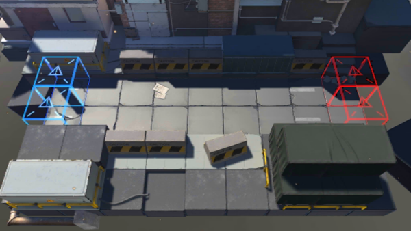

# 关卡一览————CE-2

## 关卡一览

关卡编号: CE-2

关卡名称: 工业设备押运

目标点生命值: 10

敌人总数: 45

理智消耗: 15

## 关卡地图

## 敌人情况

| 敌人图片 | 敌人名称 | 数量  |
|---------|-----|-----|
| ./eneIcons/eneIcons/Ê¿±ø.png| 士兵  |   11  |
| ./eneIcons/eneIcons/Êõʦ.png| 术师  |   2  |
| ./eneIcons/eneIcons/Ë«³Ö½£Ê¿.png| 双持剑士  |   4  |
| ./eneIcons/eneIcons/Ñý¹Ö.png| 妖怪  |   6  |
| ./eneIcons/eneIcons/Դʯ³æ.png| 源石虫  |   14  |
| ./eneIcons/eneIcons/Դʯ³æ¡¤¦Á.png| 源石虫·α  |   8  |
