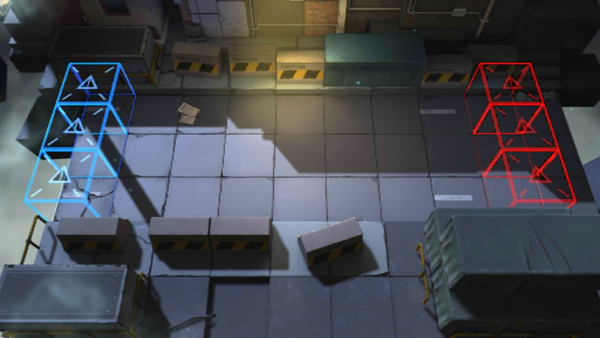

# 关卡一览————CE-3

## 关卡一览

关卡编号: CE-3

关卡名称: 珍贵原料押运

目标点生命值: 3

敌人总数: 48

理智消耗: 20

## 关卡地图

## 敌人情况

| 敌人图片 | 敌人名称 | 数量  |
|---------|-----|-----|
| ./eneIcons/eneIcons/»ú¶¯¶Ü±ø.png| 机动盾兵  |   6  |
| ./eneIcons/eneIcons/åóÊÖ.png| 弩手  |   6  |
| ./eneIcons/eneIcons/Ê°»ÄÕß.png| 拾荒者  |   3  |
| ./eneIcons/eneIcons/Ê¿±ø.png| 士兵  |   10  |
| ./eneIcons/eneIcons/Êõʦ.png| 术师  |   6  |
| ./eneIcons/eneIcons/Ë«³Ö½£Ê¿.png| 双持剑士  |   6  |
| ./eneIcons/eneIcons/Դʯ³æ¡¤¦Á.png| 源石虫·α  |   5  |
| ./eneIcons/eneIcons/Դʯ³æ¡¤¦Â.png| 源石虫·β  |   6  |
